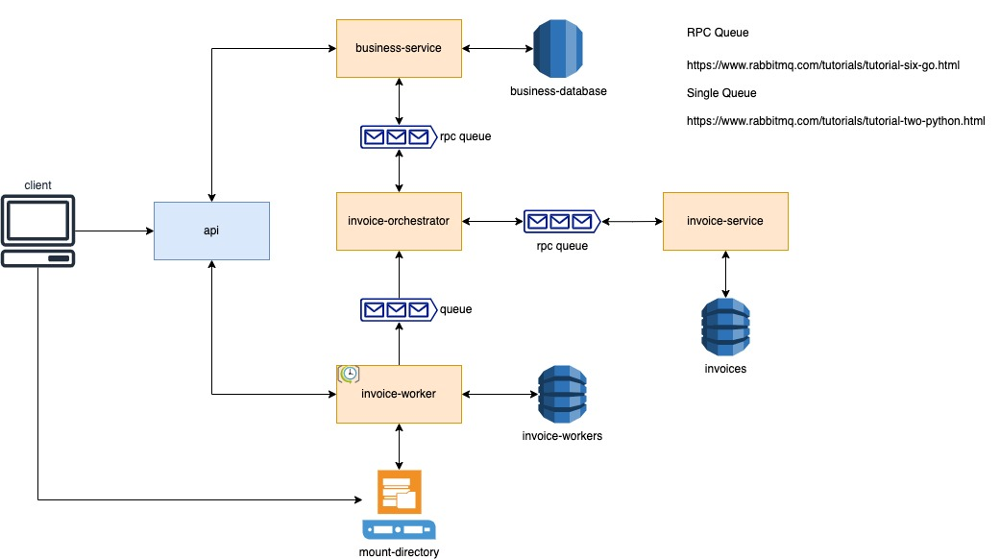

# Xepelin challennge

## A little beginning ##

>If at first you don't succeed, call it version 1.0 __~ Erick Barrera__

### Autor
* Erick Barrera - **ebarreral.isc@gmail.com**

## Contenido

* [Stack tecnológico](#stack-tecnológico)
* [Requisitos](#requisitos)
* [Arquitectura propuesta](#arquitectura-propuesta)
* [Como correr la aplicación](#como-correr-la-aplicación)
    - [Esto puede ser de gran ayuda](#esto-puede-ser-de-gran-ayuda)
	- [Importante, leer esta sección](#importante-leer-esta-sección)
* [Consideraciones](#consideraciones)
    - [Make clean](#make-clean)
    - [Obtener top de negocios](#obtener-top-de-negocios)
    - [Obtener ingresos y egresos](#obtener-ingresos-y-egresos)
    - [Procesar archivo](#procesar-archivo)
* [Mejoras](#mejoras)

## Stack tecnológico

- Node
- Typescript
- Express
- Docker
- DynamoDB
- RabbitMQ
- PostgreSQL

## Requisitos

- Sistema operativo basado en UNIX
- Docker
- AWS CLI

## Arquitectura propuesta



## Como correr la aplicación

Para su facilidad se ha colocado un *Makefile* en la raíz del proyecto

Lo único que tiene que correr es:

```
$ make run
```

### Esto puede ser de gran ayuda

Debido a que el archivo a procesar es demasiado grande y tardaría apróximadamente 2~3 horas con la configuración propuesta, he colocado en la raíz de este proyecto el backup del volumen de datos tanto para DynamoDB y PostgreSQL

Si lo de sea usar, es __muy importante__ que ejecute el siguiente comando antes de ejecutar el comando `make run`

```shell
$ make pre-context
$ make run
```

Si por error, inicio ya la aplicación es posible, ejecutando el siguiente flujo:

```shell
$ make down-all
$ make pre-context
$ make run
```

### Importante, leer esta sección

👉🏽 👉🏽 👉🏽 👉🏽 👉🏽 👉🏽 👉🏽 __README pls!!!__ 👈🏽 👈🏽 👈🏽 👈🏽 👈🏽 👈🏽 👈🏽

Ya que no cuento con los fondos para colocar un servicio de archivos y no me dí el tiempo de crear uno. Se ha implementado
un volumen interno dentro de los contenedores, lo sé, no es la mejor práctica pero para el uso del ejercicio funciona.

La aplicación ya está configurada para leer el volumne `input` desde la raíz de este proyecto.

Por lo que si lo que se desea es subir un archivo, basta con colocarlo en ese folder. La imagen docker fue construida fue
construida para leer ese punto de acceso.

```shell
/Users/mago-macabro$ git clone ....xepelin-challenge
/Users/mago-macabro$ cd xepelin-challenge
/Users/mago-macabro/xepelin-challenge$ cp ./mis-carpetas-macabras/archivo-a-copiar input/otro-archivito.csv
```

---
Cuando inicie con la solución, se fue transformando en algo más complejo pero opté por continuar con lo propuesto, ya que fue
un challenge personal el crear una comunicación RPC en lugar de REST para los servicios internos.

Hay algo muy importante a notar, hasta que no corrí el archivo completo me di cuenta, de que mi computadora murió jajaja y es debido
al diseño que tiene mejoras pero también a que los recursos son locales y compartidos al estar dentro de un contenedor.

Sin lugar a dudas, el mayor punto de dolor de DynamoDB local ya que no tiene le mismo performance y es bastante notorio en la escritura masiva
es por eso que el archivo se dividió en varios archivos para su mejor procesamiento, lo malo es que esto impacta en tiempo, ya que depende
directamente del ordenador donde esté se ejecute.


> Es por esa la razón que recomiendo ampliamente reemplazar dentro del archivo docker-compose.yml la variable de entorno CSV_SPLIT_LIMIT a 250
> esto juega un papel con la variable de entorno CHUNK_WORKER_CRON que tendrá un valor de un minuto, lo que hará que cada minuto procese 250 operaciones y sí el archivo tiene 47K de líneas serán 188 archivos aprox lo que signfica que serán 188 minutos para terminar su lectura

En caso de que la variable CSV_SPLIT_LIMIT tenga un valor mayor a 300, puede que localmente no tenga un buen funcionamiento, ya que localmente esta escriendo sobre un dynamo, un postgres y aparte replicando mediante un broker (RabbitMQ)

## Consideraciones

Puede que tenga otras imágenes corriendo sobre los mismos puertos, en ese caso. Se puede recomendar cerrar los puertos y detener los contenedores. Pero también es posibles cambiarlos sobre ambos archivos `docker-compose.yml` y `docker-compose-shared.yml`, esa decisión es bajo su elección.

Ya que no alcance a colocar un swagger, estos son los posbiles endpoints para utilizar una vez iniciada la aplicación.


### Make clean

Una vez probado su funcionamiento se puede destruir todo usando:

```
$ make clean
```

Si solo desea reiniciar todo y volver a correr, puede usar el siguiente comando.

```
$ make down-all
$ make run
```

> __Nota__: Lo anterior, incluso reinicia los datos previos guardados en la base de datos.

### Obtener top de negocios

```
GET localhost:8080/api/networks/top?limit=5
```

Donde `limit` es opcional si no se pasa este valor, por default serán 5, pero no tiene otras restricciones, incluso se podría poner un número grande 99999999999.

Response:

```json
{
    "status": 200,
    "data": [
        {
            "business_id": "17",
            "total_relationship": "716"
        },
        {
            "business_id": "2",
            "total_relationship": "474"
        },
        {
            "business_id": "8",
            "total_relationship": "201"
        },
        {
            "business_id": "7",
            "total_relationship": "191"
        },
        {
            "business_id": "78",
            "total_relationship": "176"
        }
    ]
}
```

### Obtener ingresos y egresos

```
GET localhost:8080/api/businesses/:id/summary?from_date=2022-01-01&quantity=2&frequency=MONTHS
```

Donde `id` es el negocio.

Donde `from_date` es la fecha desde donde se calcuará con los siguientes parámetros, si no se coloca este valor, por defecto será la fecha actual.

Donde `quantity` será la cardinalidad sumatoria, si no se coloca este valor por defecto es 5.

Donde `frequency` será la cantidad total de días, dentro de sus valores puede ser `DAYS | WEEKS | MONTHS`, si no se coloca este valor por defecto será DAYS

Response:

```json
{
    "status": 200,
    "data": [
        {
            "type": "INCOME",
            "total_amount": "59238562.00"
        },
        {
            "type": "OUTCOME",
            "total_amount": "23974421.00"
        }
    ]
}
```

### Procesar archivo

```
POST localhost:8080/api/invoices/process?file_name=invoices&extension=csv
```

Donde `file_name` es el nombre del archivo que colocará en directorio input, mandatorio.

Donde `extension` es la extensión del archivo, mandatorio

Response:

```json
{
    "status": 202,
    "data": {
        "file_name": "invoices",
        "extension": "csv",
        "chunks": 137,
        "path": "/xepelin/app/input/invoices-to-process"
    }
}
```


## Mejoras

Sin lugar tiene mejoras, entre más lo iba pensando más cosas se me ocurrían, definitivamente, el control de archivos es algo que me gustaría mejorar, pero acá
dejo una lista detallada.

- Colocar testing, jajaja puede sonar descabellado, pero en estña ocasión empece con el diseño en arquitectura y de responsabilidades que no hay de momento ningún test 🤣
- Implementar una capa de caché
- Posiblemente sustituir el dynamo por un mongo (sólo para el performance local)
- Colocar estados y dejar un mecánismo asíncrono en la escritura
- Colocar eventos para la distribución del mismo mensaje, incluso se puede usar la configuración de RabbitMQ en su formato fanout
- También algo que noté fue que al estar todo dentro del mismo proyecto, comparten los recuros del engine de V8 o el event loop, sería bueno que cadá servicio fuese independiente, de hecho así esta pensado, pero de momento corren sobre el mismo servidor
- Seguridad, de momento los endpoints son públicos, pero no tenía scope de momento este rubro
- Swagger, hubiese sido más sencillo documentar los endpoints por swagger
- Validaciones, mejorar el sistema de validaciones y coloar i18n para que pueda soportar varios idiomas
- Mejorar por mucho, la sincronización de archivos
- En caso de usar Dynamo, hacer un POC sobre la escritura en batch pero de forma local, quizá puede reducir la carga de trabajo y de tiempo
- Bitácora de errores en procesamiento de fallidos
